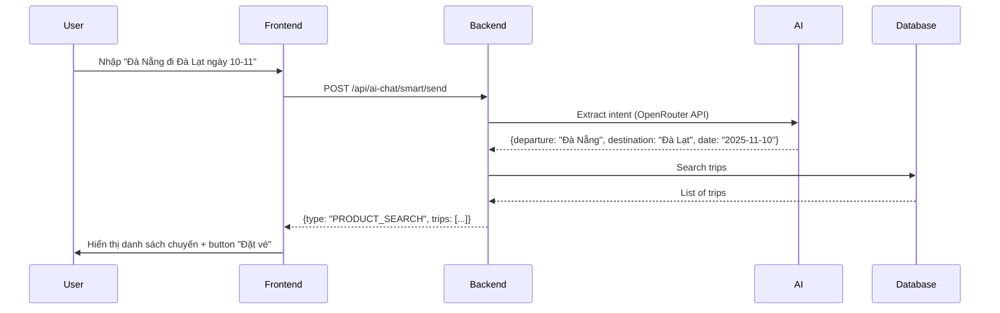

# 🤖 Hướng Dẫn Tích Hợp Smart Chatbot - Frontend

> **Ngày cập nhật**: 9/11/2025  
> **Backend API Version**: 1.0  
> **Mô tả**: Hướng dẫn tích hợp tính năng Smart Chatbot tìm kiếm chuyến xe thông minh cho frontend

---

## 📋 Mục Lục

1. [Tổng Quan](#1-tổng-quan)
2. [API Endpoints](#2-api-endpoints)
3. [Request & Response](#3-request--response)
4. [Luồng Tích Hợp](#4-luồng-tích-hợp)
5. [UI/UX Recommendations](#5-uiux-recommendations)
6. [Code Examples](#6-code-examples)
7. [Error Handling](#7-error-handling)
8. [Testing](#8-testing)

---

## 1. Tổng Quan

### 1.1. Smart Chatbot là gì?

Smart Chatbot là tính năng **tìm kiếm chuyến xe bằng ngôn ngữ tự nhiên**. Khách hàng chỉ cần nhắn tin như:
- "Tìm vé xe từ Đà Nẵng đến Đà Lạt ngày 10-11"
- "Cho tôi xem chuyến Hà Nội đi Sapa ngày mai"
- "Xe VIP Quảng Ngãi đến Hà Giang ngày 22/11"

Hệ thống AI sẽ:
1. **Tự động trích xuất** điểm đi, điểm đến, ngày đi
2. **Tìm kiếm** trong database
3. **Trả về danh sách chuyến xe** phù hợp với **link đặt vé**

### 1.2. So sánh với Chatbot thường

| Feature | General Chatbot | Smart Chatbot ⭐ |
|---------|----------------|-----------------|
| Endpoint | `/api/ai-chat/send` | `/api/ai-chat/smart/send` |
| Response | Text only | **Text + Trip List + Booking Links** |
| AI Power | GPT-3.5 (general) | **Llama-3.3-70B (specialized)** |
| Database | ❌ No | ✅ **Real-time search** |
| Use Case | FAQ, support | **Trip search & booking** |

---

## 2. API Endpoints

### 2.1. Send Smart Message (REST)

**Endpoint**: `POST /api/ai-chat/smart/send`

**Headers**:
```http
Content-Type: application/json
Authorization: Bearer {token}  # Optional - nếu user đã login
```

**Request Body**:
```json
{
  "userId": 1,                    // Optional - ID của user (nếu đã login)
  "message": "Đà Nẵng đi Đà Lạt ngày 10-11",
  "timestamp": 1731142735000      // Current timestamp (milliseconds)
}
```

⚠️ **Important - Timezone Handling:**
- Backend lưu trữ tất cả timestamps trong **UTC** (database standard)
- Frontend gửi date string trong message (AI sẽ parse theo giờ **Vietnam**)
- Ví dụ: "ngày 10-11" → AI parse thành `2025-11-10` (ngày 10/11 giờ Vietnam)
- Backend tự động convert: `2025-11-10T00:00+07:00` → `2025-11-09T17:00Z` (UTC) để query DB
- Response trả về: Tất cả datetime fields đã được convert sang giờ Vietnam để hiển thị

**Success Response** (200 OK):
```json
{
  "code": 200,
  "message": "Tin nhắn đã được xử lý thành công",
  "result": {
    "messageId": null,
    "content": "🎉 Tuyệt vời! Tôi tìm thấy **2 chuyến xe** từ **Đà Nẵng** đến **Đà Lạt** vào ngày **2025-11-10**.\n\n🚌 **Chuyến 1**: VIP - Khởi hành lúc 08:00\n   💰 Giá: **350,000đ**\n   🪑 Còn 15 ghế trống\n\n...",
    "type": "PRODUCT_SEARCH",      // ⭐ Key field
    "searchIntent": {
      "intentType": "SEARCH_TRIP",
      "departure": "Đà Nẵng",
      "destination": "Đà Lạt",
      "departureDate": "2025-11-10",
      "numberOfTickets": null,
      "busType": null,
      "priceMin": null,
      "priceMax": null,
      "confidence": 0.9
    },
    "trips": [                     // ⭐ Trip list
      {
        "tripId": 64,
        "routeName": "Đà Nẵng - Đà Lạt",
        "departureLocation": "Bến xe trung tâm Đà Nẵng",
        "arrivalLocation": "Bến xe Đà Lạt",
        "departureTime": "2025-11-10T08:00:00",
        "arrivalTime": "2025-11-10T18:30:00",
        "price": 350000.0,
        "availableSeats": 15,
        "busType": "VIP",
        "busPlate": "Nhà xe Phương Trang",
        "amenities": ["WiFi", "Điều hòa", "Nước uống"],
        "rating": 4.5,
        "hasPromotion": false,
        "discountedPrice": null,
        "imageUrl": "/images/bus/vip-danang.jpg"
      }
    ],
    "totalResults": 2,
    "needMoreInfo": false,
    "suggestedQuestions": [
      "Chuyến nào rẻ nhất?",
      "Xe VIP có không?",
      "Còn ghế trống không?"
    ],
    "timestamp": 1731142735000
  }
}
```

### 2.2. Response Types

Backend có thể trả về 5 loại response khác nhau:

| Type | Mô tả | Action Frontend |
|------|-------|-----------------|
| `PRODUCT_SEARCH` | ✅ Tìm thấy chuyến | **Hiển thị danh sách trips** + link đặt vé |
| `NEED_MORE_INFO` | ⚠️ Thiếu thông tin | Hiển thị câu hỏi gợi ý |
| `TEXT` | 💬 Không tìm thấy/General | Hiển thị text thông thường |
| `BOOKING_GUIDE` | 📖 Hướng dẫn đặt vé | Hiển thị step-by-step guide |
| `ERROR` | ❌ Lỗi hệ thống | Hiển thị error message |

---

## 3. Request & Response

### 3.1. Request DTO

```typescript
interface ChatMessageRequest {
  userId?: number;        // Optional - ID user đã login
  message: string;        // Required - Tin nhắn của user
  timestamp: number;      // Required - Current time in milliseconds
}
```

### 3.2. Response DTO

```typescript
interface SmartChatResponse {
  code: number;           // 200 = success
  message: string;        // "Tin nhắn đã được xử lý thành công"
  result: {
    messageId: string | null;
    content: string;      // AI-generated text
    type: ResponseType;   // "PRODUCT_SEARCH" | "NEED_MORE_INFO" | "TEXT" | ...
    searchIntent: SearchIntent | null;
    trips: Trip[];        // Danh sách chuyến xe (nếu có)
    totalResults: number;
    needMoreInfo: boolean;
    suggestedQuestions: string[];
    timestamp: number;
  };
}

type ResponseType = 
  | "PRODUCT_SEARCH"     // Tìm thấy chuyến
  | "NEED_MORE_INFO"     // Cần thêm thông tin
  | "TEXT"               // Câu trả lời text
  | "BOOKING_GUIDE"      // Hướng dẫn đặt vé
  | "ERROR";             // Lỗi

interface SearchIntent {
  intentType: "SEARCH_TRIP" | "ASK_PRICE" | "ASK_SCHEDULE" | "BOOK_TICKET" | "GENERAL_QUESTION";
  departure: string | null;      // "Đà Nẵng"
  destination: string | null;    // "Đà Lạt"
  departureDate: string | null;  // "2025-11-10" (ISO date)
  numberOfTickets: number | null;
  busType: string | null;        // "VIP", "thường", "giường nằm"
  priceMin: number | null;
  priceMax: number | null;
  confidence: number;            // 0.0 - 1.0
}

interface Trip {
  tripId: number;               // ⭐ ID để tạo link booking
  routeName: string;            // "Đà Nẵng - Đà Lạt"
  departureLocation: string;
  arrivalLocation: string;
  departureTime: string;        // ISO datetime
  arrivalTime: string;
  price: number;
  availableSeats: number;
  busType: string;              // "VIP", "Xe thường"
  busPlate: string;             // Operator name
  amenities: string[];          // ["WiFi", "Điều hòa", ...]
  rating: number | null;        // 0.0 - 5.0
  hasPromotion: boolean;
  discountedPrice: number | null;
  imageUrl: string | null;
}
```

---

## 4. Luồng Tích Hợp

### 4.1. Luồng cơ bản



### 4.2. Các bước implement

#### Bước 1: Tạo Chat UI Component

```jsx
// ChatWidget.jsx
import { useState } from 'react';

function ChatWidget() {
  const [messages, setMessages] = useState([]);
  const [input, setInput] = useState('');
  const [loading, setLoading] = useState(false);

  const sendMessage = async () => {
    if (!input.trim()) return;

    // Add user message
    const userMessage = {
      sender: 'user',
      content: input,
      timestamp: Date.now()
    };
    setMessages([...messages, userMessage]);
    setInput('');
    setLoading(true);

    try {
      // Call API
      const response = await fetch('/api/ai-chat/smart/send', {
        method: 'POST',
        headers: { 'Content-Type': 'application/json' },
        body: JSON.stringify({
          userId: getCurrentUserId(), // Optional
          message: input,
          timestamp: Date.now()
        })
      });

      const data = await response.json();
      
      // Add bot message
      const botMessage = {
        sender: 'bot',
        ...data.result
      };
      setMessages(prev => [...prev, botMessage]);

    } catch (error) {
      console.error('Chat error:', error);
      // Show error message
    } finally {
      setLoading(false);
    }
  };

  return (
    <div className="chat-widget">
      <div className="messages">
        {messages.map((msg, idx) => (
          <MessageBubble key={idx} message={msg} />
        ))}
      </div>
      <input 
        value={input}
        onChange={e => setInput(e.target.value)}
        onKeyPress={e => e.key === 'Enter' && sendMessage()}
        placeholder="Tìm chuyến xe..."
      />
      <button onClick={sendMessage} disabled={loading}>
        {loading ? 'Đang tìm...' : 'Gửi'}
      </button>
    </div>
  );
}
```

#### Bước 2: Hiển thị Response theo Type

```jsx
// MessageBubble.jsx
function MessageBubble({ message }) {
  if (message.sender === 'user') {
    return <div className="user-message">{message.content}</div>;
  }

  // Bot message - check type
  switch (message.type) {
    case 'PRODUCT_SEARCH':
      return (
        <div className="bot-message">
          <div className="text">{message.content}</div>
          <TripList trips={message.trips} />
          <SuggestedQuestions questions={message.suggestedQuestions} />
        </div>
      );

    case 'NEED_MORE_INFO':
      return (
        <div className="bot-message info">
          <div className="text">{message.content}</div>
          <SuggestedQuestions questions={message.suggestedQuestions} />
        </div>
      );

    case 'TEXT':
    case 'BOOKING_GUIDE':
    case 'ERROR':
    default:
      return (
        <div className="bot-message">
          <div className="text">{message.content}</div>
          {message.suggestedQuestions?.length > 0 && (
            <SuggestedQuestions questions={message.suggestedQuestions} />
          )}
        </div>
      );
  }
}
```

#### Bước 3: Component Trip List

```jsx
// TripList.jsx
function TripList({ trips }) {
  if (!trips || trips.length === 0) return null;

  return (
    <div className="trip-list">
      {trips.map(trip => (
        <TripCard key={trip.tripId} trip={trip} />
      ))}
    </div>
  );
}

function TripCard({ trip }) {
  const handleBooking = () => {
    // Navigate to booking page
    window.location.href = `/booking/${trip.tripId}`;
    // Or: navigate(`/booking/${trip.tripId}`); // React Router
  };

  return (
    <div className="trip-card">
      <div className="trip-header">
        <h3>{trip.routeName}</h3>
        <span className="bus-type">{trip.busType}</span>
      </div>

      <div className="trip-details">
        <div className="time">
          <span>🕐 {formatTime(trip.departureTime)}</span>
          <span>→</span>
          <span>{formatTime(trip.arrivalTime)}</span>
        </div>

        <div className="price">
          {trip.hasPromotion && trip.discountedPrice ? (
            <>
              <span className="old-price">{formatPrice(trip.price)}</span>
              <span className="new-price">{formatPrice(trip.discountedPrice)} 🎁</span>
            </>
          ) : (
            <span className="price">{formatPrice(trip.price)}</span>
          )}
        </div>

        <div className="seats">
          🪑 Còn {trip.availableSeats} ghế
        </div>

        {trip.rating && (
          <div className="rating">
            ⭐ {trip.rating}/5
          </div>
        )}

        <div className="amenities">
          {trip.amenities.map(amenity => (
            <span key={amenity} className="badge">{amenity}</span>
          ))}
        </div>
      </div>

      <button 
        className="btn-booking"
        onClick={handleBooking}
      >
        Đặt vé ngay
      </button>
    </div>
  );
}

// Helper functions
function formatTime(isoDateTime) {
  const date = new Date(isoDateTime);
  return date.toLocaleTimeString('vi-VN', { 
    hour: '2-digit', 
    minute: '2-digit' 
  });
}

function formatPrice(price) {
  return new Intl.NumberFormat('vi-VN', {
    style: 'currency',
    currency: 'VND'
  }).format(price);
}
```

#### Bước 4: Suggested Questions

```jsx
// SuggestedQuestions.jsx
function SuggestedQuestions({ questions, onQuestionClick }) {
  if (!questions || questions.length === 0) return null;

  return (
    <div className="suggested-questions">
      <p className="label">Câu hỏi gợi ý:</p>
      <div className="questions">
        {questions.map((q, idx) => (
          <button
            key={idx}
            className="question-btn"
            onClick={() => onQuestionClick(q)}
          >
            {q}
          </button>
        ))}
      </div>
    </div>
  );
}
```

---

## 5. UI/UX Recommendations

### 5.1. Chat Interface

**Recommended Layout**:
```
┌─────────────────────────────────┐
│  🤖 Smart Chatbot - Tìm vé xe   │
├─────────────────────────────────┤
│                                 │
│  [User] Đà Nẵng đi Đà Lạt 10-11│
│                                 │
│  [Bot] 🎉 Tìm thấy 2 chuyến...  │
│  ┌──────────────────────────┐  │
│  │ 🚌 Chuyến 1: VIP         │  │
│  │ 🕐 08:00 → 18:30         │  │
│  │ 💰 350,000đ              │  │
│  │ 🪑 Còn 15 ghế            │  │
│  │ [Đặt vé ngay]            │  │
│  └──────────────────────────┘  │
│                                 │
│  Câu hỏi gợi ý:                 │
│  [Chuyến rẻ nhất] [Xe VIP]     │
│                                 │
├─────────────────────────────────┤
│ [Tìm chuyến xe...]         [Gửi]│
└─────────────────────────────────┘
```

### 5.2. Loading States

```jsx
// While waiting for response
<div className="loading">
  <div className="spinner"></div>
  <p>Đang tìm kiếm chuyến xe phù hợp...</p>
</div>
```

### 5.3. Empty State

```jsx
// When no trips found
<div className="empty-state">
  
  <h3>Không tìm thấy chuyến phù hợp</h3>
  <p>Vui lòng thử tìm kiếm ngày khác hoặc thay đổi điểm đi/đến</p>
  <button>Tìm lại</button>
</div>
```

### 5.4. Responsive Design

- **Mobile**: Chat full screen với floating button
- **Tablet**: Chat panel bên phải (40% width)
- **Desktop**: Chat widget dạng popup (350px x 600px)

---

## 6. Code Examples

### 6.1. React + Axios

```javascript
import axios from 'axios';

const API_BASE_URL = 'http://localhost:8080/api';

export const sendSmartChatMessage = async (message, userId = null) => {
  try {
    const response = await axios.post(`${API_BASE_URL}/ai-chat/smart/send`, {
      userId,
      message,
      timestamp: Date.now()
    }, {
      headers: {
        'Content-Type': 'application/json',
        // Add auth token if available
        'Authorization': `Bearer ${getAuthToken()}`
      }
    });

    return response.data.result;
  } catch (error) {
    console.error('Smart chat error:', error);
    throw error;
  }
};
```

### 6.2. Vue.js

```javascript
// composables/useSmartChat.js
import { ref } from 'vue';

export function useSmartChat() {
  const messages = ref([]);
  const loading = ref(false);

  const sendMessage = async (text) => {
    loading.value = true;

    try {
      const response = await fetch('/api/ai-chat/smart/send', {
        method: 'POST',
        headers: { 'Content-Type': 'application/json' },
        body: JSON.stringify({
          message: text,
          timestamp: Date.now()
        })
      });

      const data = await response.json();
      messages.value.push({
        sender: 'user',
        content: text,
        timestamp: Date.now()
      });
      messages.value.push({
        sender: 'bot',
        ...data.result
      });

      return data.result;
    } finally {
      loading.value = false;
    }
  };

  return { messages, loading, sendMessage };
}
```

### 6.3. Angular

```typescript
// smart-chat.service.ts
import { Injectable } from '@angular/core';
import { HttpClient } from '@angular/common/http';
import { Observable } from 'rxjs';

export interface SmartChatRequest {
  userId?: number;
  message: string;
  timestamp: number;
}

@Injectable({ providedIn: 'root' })
export class SmartChatService {
  private apiUrl = 'http://localhost:8080/api/ai-chat/smart/send';

  constructor(private http: HttpClient) {}

  sendMessage(message: string, userId?: number): Observable<any> {
    const request: SmartChatRequest = {
      message,
      timestamp: Date.now(),
      ...(userId && { userId })
    };

    return this.http.post(this.apiUrl, request);
  }
}
```

---

## 7. Error Handling

### 7.1. Error Types

```typescript
interface ErrorResponse {
  code: number;
  message: string;
  result: {
    type: "ERROR";
    content: string;
  };
}
```

### 7.2. Handle Errors

```javascript
try {
  const response = await sendSmartChatMessage(message);
  
  if (response.type === 'ERROR') {
    // Show error message
    showErrorNotification(response.content);
  }
} catch (error) {
  if (error.response?.status === 401) {
    // Unauthorized
    redirectToLogin();
  } else if (error.response?.status === 500) {
    // Server error
    showErrorNotification('Đã xảy ra lỗi hệ thống. Vui lòng thử lại sau.');
  } else {
    // Network error
    showErrorNotification('Không thể kết nối đến server. Vui lòng kiểm tra kết nối mạng.');
  }
}
```

### 7.3. Common Error Messages

| Error | Message | Action |
|-------|---------|--------|
| 400 Bad Request | "Tin nhắn không hợp lệ" | Validate input |
| 401 Unauthorized | "Vui lòng đăng nhập" | Redirect to login |
| 500 Server Error | "Lỗi hệ thống" | Show retry button |
| Network Error | "Không có kết nối" | Check network |

---

## 8. Testing

### 8.1. Test Cases

| Test Case | Input | Expected Result |
|-----------|-------|-----------------|
| Basic search | "Đà Nẵng đi Đà Lạt ngày 10-11" | type=PRODUCT_SEARCH, trips.length > 0 |
| No trips found | "Đà Nẵng đi Tokyo" | type=TEXT, trips=[] |
| Missing info | "Tìm vé xe đi Đà Lạt" | type=NEED_MORE_INFO |
| General question | "Giá vé như thế nào?" | type=TEXT |
| Multiple formats | "10/11", "10-11", "ngày mai" | All parse correctly |

### 8.2. Postman Collection

```json
{
  "info": {
    "name": "Smart Chatbot API",
    "schema": "https://schema.getpostman.com/json/collection/v2.1.0/collection.json"
  },
  "item": [
    {
      "name": "Send Smart Message - Success",
      "request": {
        "method": "POST",
        "header": [
          {
            "key": "Content-Type",
            "value": "application/json"
          }
        ],
        "body": {
          "mode": "raw",
          "raw": "{\n  \"userId\": 1,\n  \"message\": \"Đà Nẵng đi Đà Lạt ngày 10-11\",\n  \"timestamp\": 1731142735000\n}"
        },
        "url": {
          "raw": "http://localhost:8080/api/ai-chat/smart/send",
          "protocol": "http",
          "host": ["localhost"],
          "port": "8080",
          "path": ["api", "ai-chat", "smart", "send"]
        }
      }
    },
    {
      "name": "Send Smart Message - Need More Info",
      "request": {
        "method": "POST",
        "header": [
          {
            "key": "Content-Type",
            "value": "application/json"
          }
        ],
        "body": {
          "mode": "raw",
          "raw": "{\n  \"message\": \"Tìm vé xe đi Đà Lạt\",\n  \"timestamp\": 1731142735000\n}"
        },
        "url": {
          "raw": "http://localhost:8080/api/ai-chat/smart/send",
          "protocol": "http",
          "host": ["localhost"],
          "port": "8080",
          "path": ["api", "ai-chat", "smart", "send"]
        }
      }
    }
  ]
}
```

### 8.3. Sample Test Data

```javascript
// Test với các format khác nhau
const testCases = [
  {
    input: "Đà Nẵng đi Đà Lạt ngày 10-11",
    expected: { departure: "Đà Nẵng", destination: "Đà Lạt", date: "2025-11-10" }
  },
  {
    input: "Cho tôi tìm chuyến xe từ Quảng Ngãi đến Hà Giang ngày 22/11",
    expected: { departure: "Quảng Ngãi", destination: "Hà Giang", date: "2025-11-22" }
  },
  {
    input: "Hà Nội Sapa ngày mai",
    expected: { departure: "Hà Nội", destination: "Sapa", date: "2025-11-10" }
  },
  {
    input: "xe VIP Cần Thơ đi Giáp Bát",
    expected: { departure: "Cần Thơ", destination: "Giáp Bát", busType: "VIP" }
  }
];
```

---

## 9. Best Practices

### 9.1. Performance

- **Debounce input**: Chờ 500ms sau khi user ngừng gõ mới gọi API
- **Cache responses**: Cache kết quả tìm kiếm trong 5 phút
- **Lazy load trips**: Chỉ hiển thị 3-5 chuyến đầu, có button "Xem thêm"

```javascript
import debounce from 'lodash/debounce';

const debouncedSend = debounce(async (message) => {
  await sendMessage(message);
}, 500);
```

### 9.2. Accessibility

- Sử dụng semantic HTML: `<main>`, `<article>`, `<button>`
- Add ARIA labels: `aria-label="Tin nhắn từ chatbot"`
- Keyboard navigation: Enter để gửi, Esc để đóng chat
- Screen reader friendly

### 9.3. Security

- **Sanitize user input**: Tránh XSS
- **Rate limiting**: Giới hạn 10 requests/phút
- **Validate responses**: Check response structure trước khi render

```javascript
import DOMPurify from 'dompurify';

const sanitizedMessage = DOMPurify.sanitize(userInput);
```

---

## 10. Troubleshooting

### 10.1. Common Issues

| Issue | Cause | Solution |
|-------|-------|----------|
| Response type always TEXT | AI không trích xuất được intent | Cải thiện format input: "từ X đến Y ngày Z" |
| trips = [] | Không có chuyến trong DB | Check database, insert test data |
| 401 Unauthorized | Token hết hạn | Refresh token hoặc login lại |
| Slow response | AI processing | Show loading spinner, consider caching |

### 10.2. Debug Tips

```javascript
// Enable debug mode
localStorage.setItem('DEBUG_CHAT', 'true');

// Log all requests/responses
if (localStorage.getItem('DEBUG_CHAT')) {
  console.log('Request:', request);
  console.log('Response:', response);
}
```

---

## 11. Migration Notes

Nếu đang dùng **General Chatbot** (`/api/ai-chat/send`), cần migration:

### Before (General Chatbot)
```javascript
// Chỉ nhận text response
const response = await fetch('/api/ai-chat/send', { ... });
const { content } = response.data.result;
// Render: <p>{content}</p>
```

### After (Smart Chatbot)
```javascript
// Nhận cả text + trips
const response = await fetch('/api/ai-chat/smart/send', { ... });
const { content, type, trips } = response.data.result;

// Render based on type
if (type === 'PRODUCT_SEARCH' && trips.length > 0) {
  // Render trip cards + booking buttons
} else {
  // Render text only
}
```

---

## 12. FAQs

### Q1: User chưa login có dùng được không?
**A**: Có! Chỉ cần bỏ `userId` hoặc truyền `null`. Backend sẽ dùng `"anonymous"`.

### Q2: Làm sao biết chuyến nào đang có khuyến mãi?
**A**: Check field `trip.hasPromotion === true` và `trip.discountedPrice !== null`.

### Q3: Link đặt vé là gì?
**A**: Dùng `trip.tripId` để tạo link: `/booking/${trip.tripId}` hoặc `/trip/${trip.tripId}/booking`.

### Q4: AI có hỗ trợ tiếng Anh không?
**A**: Hiện tại chỉ hỗ trợ tiếng Việt. Có thể mở rộng sau.

### Q5: Làm sao để test mà không tốn tiền OpenRouter?
**A**: Backend có regex fallback, nếu AI lỗi sẽ tự động dùng regex. Hoặc dùng Postman với expected format.

---

## 13. Contact & Support

- **Backend Developer**: [Your Team]
- **API Documentation**: http://localhost:8080/swagger-ui.html
- **Bug Reports**: [GitHub Issues / Jira]
- **Slack Channel**: #smart-chatbot-support

---

## 14. Changelog

| Version | Date | Changes |
|---------|------|---------|
| 1.0.0 | 2025-11-09 | ✅ Initial release - Smart Chatbot with trip search |
| | | ✅ Support 60+ locations (cities + bus stations) |
| | | ✅ AI-powered intent extraction (Llama-3.3-70B) |
| | | ✅ Real-time database search |
| | | ✅ Filter by date (LocalDate in Vietnam timezone) |

---

## 15. Appendix

### A. Supported Locations

**Miền Bắc**: Hà Nội, Giáp Bát, Mỹ Đình, Hải Phòng, Hạ Long, Ninh Bình, Sapa, Hà Giang, Cao Bằng, Lào Cai, Điện Biên, Sơn La, Yên Bái, Thái Nguyên, Lạng Sơn, Bắc Giang, Bắc Ninh...

**Miền Trung**: Đà Nẵng, Huế, Nha Trang, Đà Lạt, Hội An, Quy Nhơn, Vũng Tàu, Thanh Hóa, Vinh, Quảng Bình, Quảng Trị, Quảng Nam, Quảng Ngãi...

**Miền Nam**: TP.HCM, Sài Gòn, Miền Đông, Miền Tây, Cần Thơ, An Giang, Kiên Giang, Đồng Nai, Bình Dương, Vĩnh Long, Cà Mau...

### B. Date Formats Supported

- `10-11`, `10/11`, `10.11`
- `ngày 10 tháng 11`, `10 tháng 11`
- `ngày mai`, `hôm nay`, `cuối tuần`
- ISO: `2025-11-10`

---

**🎉 Good luck với việc tích hợp! Nếu có vấn đề gì, ping ngay team backend nhé!**
